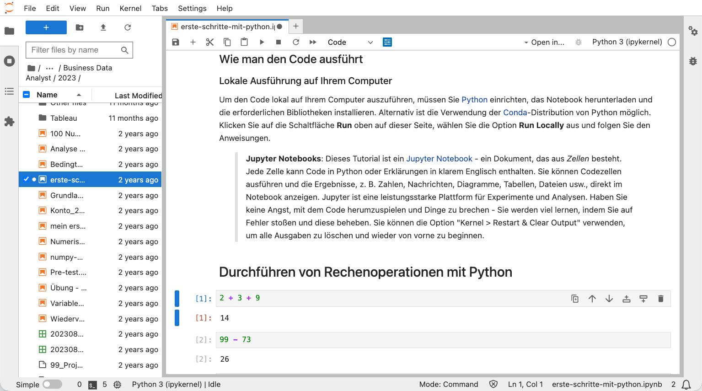

# KI Python lernen {#sec-ki-python-lernen}

## Willkommen zu KI Python {#sec-willkommen}

Hallo und herzlich willkommen! Dieses Buch ist Ihr Einstieg in eine der wichtigsten Fähigkeiten des 21. Jahrhunderts: das Programmieren mit Python und die Entwicklung eigener KI-Anwendungen. In einer Welt, die zunehmend von Daten, Automatisierung und künstlicher Intelligenz geprägt ist, eröffnen sich für diejenigen, die diese Technologien verstehen und anwenden können, völlig neue Möglichkeiten.

### Warum Python und KI lernen?

Warum ist das Erlernen von Python und KI heute so wichtig? Die Antwort liegt in den tiefgreifenden Veränderungen, die unsere Arbeitswelt und Gesellschaft durchlaufen.

Unternehmen aller Branchen befinden sich mitten in einem digitalen Wandel, der nicht nur technische Systeme betrifft, sondern die Art und Weise verändert, wie wir arbeiten, Entscheidungen treffen und Probleme lösen. Wer die Grundlagen der Programmierung und KI beherrscht, kann diesen Wandel nicht nur verstehen, sondern aktiv mitgestalten und innovative Lösungen entwickeln.

In der modernen Arbeitswelt werden Entscheidungen zunehmend auf Basis von Daten getroffen. Mit Python können Sie Daten analysieren, visualisieren und daraus wertvolle Erkenntnisse gewinnen, die Ihnen einen entscheidenden Vorteil verschaffen. Statt sich auf Bauchgefühl oder veraltete Informationen zu verlassen, ermöglicht Ihnen die Programmierung, fundierte, datenbasierte Entscheidungen zu treffen, die nachvollziehbar und reproduzierbar sind.

Ein weiterer entscheidender Vorteil liegt in der Automatisierung. Viele repetitive Aufgaben, die heute noch manuell erledigt werden, lassen sich durch Programmierung automatisieren. Dies spart nicht nur Zeit und reduziert Fehler, sondern ermöglicht es Ihnen auch, sich auf kreativere und strategischere Tätigkeiten zu konzentrieren. Anstatt Stunden mit dem Kopieren von Daten oder dem Erstellen von Berichten zu verbringen, können Sie diese Prozesse automatisieren und Ihre Energie auf wertschöpfende Aktivitäten lenken.

Die Nachfrage nach Fachkräften mit Programmierkenntnissen und KI-Expertise wächst exponentiell. Diese Fähigkeiten sind längst nicht mehr nur in der IT-Branche gefragt, sondern in nahezu allen Berufsfeldern – von der Wirtschaft über die Wissenschaft bis hin zum Gesundheitswesen. Wer heute in Python und KI investiert, sichert sich zukunftssichere Karrierechancen und öffnet Türen zu spannenden beruflichen Möglichkeiten.

Nicht zuletzt ermöglicht Ihnen das Erlernen von Python und KI, Ihre eigenen Ideen in die Realität umzusetzen. Ob eine intelligente Datenanalyse für Ihr Unternehmen, ein Chatbot zur Automatisierung von Kundenanfragen oder eine innovative App zur Lösung eines spezifischen Problems – mit den richtigen Kenntnissen können Sie Ihre Visionen selbst verwirklichen, ohne auf externe Dienstleister angewiesen zu sein.

::: {.callout-note icon="false"}
## 📘 Für Einsteiger konzipiert

Dieses Buch ist speziell für Einsteiger konzipiert und erfordert keine Vorkenntnisse in der Programmierung. Sie werden Schritt für Schritt durch alle wichtigen Konzepte geführt und lernen von Anfang an praxisorientiert. Der Fokus liegt darauf, Ihnen die notwendigen Fähigkeiten zu vermitteln, um eigenständig Programme zu schreiben und KI-Technologien sinnvoll einzusetzen.
:::

Dieses Buch wurde mit der Überzeugung entwickelt, dass jeder die Grundlagen der Programmierung und KI erlernen kann, wenn die richtigen Werkzeuge und Methoden eingesetzt werden.

Und hier ist die gute Nachricht: Es war noch nie so einfach wie heute, Programmieren zu lernen. Während frühere Generationen von Programmierern sich mühsam durch komplexe Dokumentationen kämpfen und jedes Problem alleine lösen mussten, stehen Ihnen heute revolutionäre Hilfsmittel zur Verfügung, die den Lernprozess grundlegend verändert haben.

Die Verfügbarkeit von KI-gestützten Chatbots wie ChatGPT, Claude oder anderen intelligenten Assistenten hat das Lernen von Programmierung demokratisiert. Diese Tools fungieren als geduldige, jederzeit verfügbare Tutoren, die Ihnen Konzepte erklären, Fehler in Ihrem Code finden, Lösungsansätze vorschlagen und Sie Schritt für Schritt durch komplexe Probleme führen.

Was früher Stunden oder Tage der Recherche erforderte, lässt sich heute in Minuten klären. Diese Entwicklung senkt die Einstiegshürde dramatisch und macht Programmierung für jeden zugänglich – unabhängig von Vorkenntnissen oder technischem Hintergrund.

Genau deshalb sollte heute jeder – zumindest in einem gewissen Maß – Programmieren lernen. Es geht nicht darum, dass jeder zum professionellen Softwareentwickler werden muss. Vielmehr geht es darum, ein grundlegendes Verständnis für die digitale Welt zu entwickeln, in der wir leben und arbeiten. Wer die Grundprinzipien der Programmierung versteht, kann besser einschätzen, was technisch möglich ist, effektiver mit IT-Teams kommunizieren und vor allem: selbstständig kleine Automatisierungen und Lösungen entwickeln, die den eigenen Arbeitsalltag erleichtern.

In diesem Buch werden Sie nicht nur trockene Theorie finden, sondern von Anfang an dazu ermutigt, aktiv zu werden, zu experimentieren und eigene Projekte umzusetzen. Ein besonderer Schwerpunkt liegt auf der Nutzung von KI-gestützten Chatbots als persönliche Lernpartner, die Ihnen helfen, Herausforderungen zu meistern und Ihr volles Potenzial zu entfalten. Sie werden lernen, wie Sie diese Tools effektiv einsetzen, die richtigen Fragen stellen und die erhaltenen Antworten kritisch bewerten und anpassen.


::: {.callout-important icon="false"}
## 🚀 Lernen Sie gemeinsam mit anderen

Programmieren lernt man am besten im Austausch. Werden Sie Teil unserer kostenlosen Community, vernetzen Sie sich mit Gleichgesinnten und profitieren Sie von den Erfahrungen anderer. Gemeinsam meistern wir Herausforderungen und gestalten die digitale Zukunft.

**[Jetzt der Business Data Professional Community beitreten →](https://www.skool.com/business-data-professional)**
:::

## Warum KI Python?

"KI Python" vereint zwei der wichtigsten Technologien unserer Zeit: Künstliche Intelligenz und die Programmiersprache Python. Aber warum eigentlich diese Kombination? 

::: {.callout-tip icon="false"}
## 🐍 Python - Die #1 in der KI-Welt

Python hat sich in den letzten Jahren zur unangefochtenen Nummer eins in der Welt der KI entwickelt. Die Sprache ist nicht nur einfach zu lernen, sondern bietet auch eine riesige Auswahl an Bibliotheken und Frameworks, die speziell für die Entwicklung von KI-Anwendungen konzipiert wurden.
:::

Ein entscheidender Vorteil, der Python zur idealen Sprache für die Arbeit mit KI macht: **KI-Systeme sind praktisch "Python-Muttersprachler"**.

Was bedeutet das konkret? Wenn Sie heute mit KI-Chatbots wie ChatGPT, Claude oder anderen intelligenten Assistenten arbeiten und diese um Hilfe beim Programmieren bitten, werden sie Ihnen bevorzugt Python-Code liefern – und zwar in hervorragender Qualität.

Der Grund dafür liegt in den Trainingsdaten dieser KI-Modelle. Sie wurden mit Millionen von Zeilen Python-Code trainiert, da Python die dominierende Sprache in der Data Science, im Machine Learning und in der KI-Entwicklung ist.

Das bedeutet für Sie: Die KI versteht Python nicht nur besser als die meisten anderen Programmiersprachen, sondern kann Ihnen auch präzisere Erklärungen geben, bessere Lösungsvorschläge machen und Ihren Code effektiver debuggen. Wenn Sie Python lernen, lernen Sie also die Sprache, in der KI-Systeme am besten "denken" und kommunizieren können.

In diesem Buch werden Sie lernen, wie Sie diese Synergie nutzen können, um beeindruckende Ergebnisse zu erzielen. Sie werden entdecken, wie Sie mit Python nicht nur programmieren, sondern auch mit KI-Modellen interagieren, Daten analysieren und intelligente Lösungen für reale Probleme entwickeln können. Der Name "KI Python" ist also Programm: Sie lernen, wie Sie die Kraft der KI mit der Eleganz und Einfachheit von Python kombinieren können – und dabei die Tatsache nutzen, dass beide perfekt aufeinander abgestimmt sind.

Wir wünschen Ihnen viel Erfolg und freuen uns auf eine inspirierende gemeinsame Lernzeit!

## Was ist Programmieren?

Was genau bedeutet es eigentlich, zu "programmieren" oder zu "coden"? Im Grunde ist es gar nicht so kompliziert, wie es vielleicht klingen mag.

::: {.callout-note icon="false"}
## 🍳 Programmieren ist wie Kochen

Stellen Sie sich vor, Sie schreiben eine sehr detaillierte Anleitung für einen Computer. Diese Anleitung besteht aus einer Reihe von Anweisungen, die der Computer Schritt für Schritt ausführt, um ein bestimmtes Ziel zu erreichen. Man kann es auch mit einem Kochrezept vergleichen: Jede Zeile im Rezept ist eine Anweisung, und wenn man alle Anweisungen in der richtigen Reihenfolge befolgt, erhält man am Ende ein köstliches Gericht.
:::

Beim Programmieren ist es ganz ähnlich. Wir schreiben Anweisungen in einer Sprache, die der Computer versteht – in unserem Fall Python. Diese Anweisungen können ganz einfach sein, wie "addiere zwei Zahlen" oder "gib einen Text auf dem Bildschirm aus". Sie können aber auch sehr komplex werden und dem Computer beibringen, Bilder zu erkennen, Texte zu übersetzen oder sogar selbstständig zu lernen.

Das Schöne am Programmieren ist, dass es eine unglaublich kreative Tätigkeit ist. Sie haben eine Idee und können diese mit Hilfe von Code in die Realität umsetzen. Anders als bei vielen anderen Fertigkeiten sind Ihrer Kreativität dabei kaum Grenzen gesetzt. Möchten Sie ein Tool entwickeln, das Ihre täglichen Arbeitsabläufe automatisiert? Oder vielleicht eine Anwendung, die Daten analysiert und visualisiert? Mit Programmierkenntnissen können Sie diese Visionen selbst verwirklichen, ohne auf teure Software oder externe Dienstleister angewiesen zu sein.

Der Einstieg in die Programmierung mag zunächst wie das Erlernen einer Fremdsprache erscheinen – und in gewisser Weise ist es das auch. Aber im Gegensatz zu menschlichen Sprachen ist die Grammatik von Python klar definiert und logisch aufgebaut. Es gibt keine unregelmäßigen Verben oder komplizierte Ausnahmen, die man auswendig lernen muss. Stattdessen folgen Sie klaren Regeln und Mustern, die Sie Schritt für Schritt erlernen werden.

In diesem Buch werden wir Ihnen die grundlegenden "Zutaten" und "Kochtechniken" des Programmierens beibringen, damit Sie schon bald Ihre eigenen "Rezepte" schreiben können. Sie werden lernen, wie man Daten speichert und verarbeitet, wie man Entscheidungen im Code trifft, wie man Aufgaben wiederholt und wie man komplexe Probleme in kleinere, lösbare Teile zerlegt. Mit jedem Kapitel werden Sie mehr Selbstvertrauen gewinnen und feststellen, dass Programmieren nicht nur nützlich, sondern auch richtig Spaß machen kann.

## Programmieren mit Chatbots

In der heutigen Zeit müssen Sie das Programmieren nicht mehr alleine lernen. KI-gestützte Chatbots, wie zum Beispiel ChatGPT, sind zu wertvollen Werkzeugen für Programmierer und solche, die es werden wollen, geworden. Diese intelligenten Assistenten können Ihnen auf vielfältige Weise beim Lernen und bei der Entwicklung von Code helfen.

::: {.callout-note icon="false"}
## 🤖 Wie können Chatbots Sie unterstützen?

**Fehler finden und beheben:** Wenn Ihr Code nicht wie erwartet funktioniert, können Sie den fehlerhaften Code einfach in den Chatbot kopieren und um Hilfe bitten. Der Chatbot analysiert den Code, identifiziert den Fehler und schlägt Ihnen eine korrigierte Version vor.

**Konzepte erklären:** Wenn Sie ein bestimmtes Programmierkonzept nicht verstehen, können Sie den Chatbot bitten, es Ihnen in einfachen Worten zu erklären. Sie können sogar nach Beispielen fragen, um das Konzept besser zu veranschaulichen.

**Code generieren:** Sie können dem Chatbot eine Beschreibung dessen geben, was Ihr Code tun soll, und er wird Ihnen einen funktionierenden Code-Schnipsel generieren. Dies ist besonders nützlich, wenn Sie eine Idee schnell ausprobieren oder eine Vorlage für Ihren eigenen Code benötigen.

**Code optimieren:** Wenn Sie bereits einen funktionierenden Code haben, können Sie den Chatbot bitten, ihn zu optimieren. Er kann Ihnen Vorschläge machen, wie Sie den Code effizienter, lesbarer oder sicherer gestalten können.
:::

In diesem Buch werden wir Ihnen zeigen, wie Sie Chatbots gezielt als Ihre persönlichen Lernpartner einsetzen können. Sie werden lernen, wie Sie die richtigen Fragen stellen, um die besten Ergebnisse zu erzielen, und wie Sie die Vorschläge des Chatbots kritisch hinterfragen und an Ihre eigenen Bedürfnisse anpassen können. Mit der Unterstützung von KI werden Sie schneller und effektiver lernen, als Sie es sich je hätten vorstellen können.

Ein besonderer Vorteil für Sie: In unserer [Community](https://www.skool.com/business-data-professional) erhalten Sie **kostenlosen Zugang zu einem speziell konfigurierten KI-Chatbot**, der Sie optimal beim Lernen unterstützt. Dieser Chatbot ist auf die Inhalte dieses Buches abgestimmt und kann Ihnen jederzeit bei Fragen, Problemen oder Übungen helfen.

## Wie wir "aktiv" gemeinsam lernen {#sec-aktives-lernen}

Lernen ist am effektivsten, wenn es ein aktiver und gemeinschaftlicher Prozess ist. Dieses Buch basiert auf einem bewährten Lernkonzept, das wir über mehrere Jahre hinweg mit mehr als 250 Teilnehmern in unseren IHK-Kursen entwickelt und kontinuierlich verfeinert haben: die **aktive Lernschleife**.

### Die wissenschaftliche Grundlage

Unser Ansatz basiert auf etablierten Erkenntnissen der Lernforschung, insbesondere den Prinzipien aus "Make It Stick: The Science of Successful Learning" von Brown, Roediger und McDaniel (2014). Die Autoren zeigen eindrucksvoll, dass nachhaltiges Lernen nicht durch passives Lesen oder wiederholtes Anschauen von Material entsteht, sondern durch aktives Abrufen, Anwenden und Reflektieren des Gelernten. Wichtige Impulse stammen aus der Forschung zu Active Learning (Freeman et al., 2014) und Deliberate Practice (Ericsson, Krampe & Tesch-Römer, 1993; Ericsson & Pool, 2016), die zeigen, dass Lernende, die aktiv und gezielt mit dem Material arbeiten, signifikant bessere und nachhaltigere Lernerfolge erzielen.

### Die vier Phasen der aktiven Lernschleife

**1. 👂 Hör zu – Verstehe die Grundlagen**  
Jede Lerneinheit beginnt mit einer klaren, strukturierten Einführung in neue Konzepte. Sie erhalten die theoretischen Grundlagen, die Sie benötigen, um das Thema zu verstehen. Dabei setzen wir auf verständliche Erklärungen, praktische Beispiele und visuelle Darstellungen. Nutzen Sie auch KI-Chatbots als Ihre persönlichen Lernbegleiter, um Konzepte zu vertiefen, Fragen sofort zu klären oder alternative Erklärungen zu erhalten, wenn etwas noch nicht ganz klar ist.

**2. 💻 Mach mit – Wende es direkt an**  
Theorie allein reicht nicht aus. Nach jeder Einführung sind Sie an der Reihe: Öffnen Sie die begleitenden Jupyter Notebooks und probieren Sie den Code selbst aus. Experimentieren Sie mit den Beispielen, verändern Sie Parameter, brechen Sie bewusst etwas, um zu sehen, was passiert. Dieser praktische Schritt ist entscheidend, um ein tiefes, intuitives Verständnis für die Materie zu entwickeln. Die Forschung zeigt: Wer aktiv mit dem Material arbeitet, behält bis zu 75% mehr als bei passivem Konsum.

**3. 💬 Tausch Dich aus – Lerne von anderen**  
Lernen ist ein sozialer Prozess. Im dritten Schritt wenden Sie das Gelernte auf eine neue Problemstellung an. Jede Lerneinheit enthält Übungsaufgaben, die Sie herausfordern, das neue Wissen kreativ einzusetzen. Tauschen Sie sich in unserer [Community](https://www.skool.com/business-data-professional) mit anderen Lernenden über Ihre Lösungen aus. Durch das Erklären Ihrer Ansätze und das Verstehen anderer Perspektiven vertiefen Sie Ihr eigenes Verständnis erheblich – ein Effekt, der in der Lernforschung als "Learning by Teaching" bekannt ist.

**4. 🤖 Hol Dir Hilfe – Nutze KI als Lernpartner**  
Fehler und Herausforderungen sind nicht nur normal, sondern essentiell für den Lernprozess. Wenn Sie nicht weiterkommen, nutzen Sie KI-Chatbots, um Fehler zu finden, Code zu verstehen und alternative Lösungen zu entwickeln. Diese intelligenten Assistenten sind Ihre persönlichen Tutoren, die rund um die Uhr verfügbar sind und Ihnen helfen, Blockaden zu überwinden und kontinuierlich voranzukommen.

{#fig-lernschleife fig-align="left" width="60%"}

Diese vier Phasen wiederholen sich in jedem Kapitel und bilden einen Kreislauf, der sicherstellt, dass Sie nicht nur passiv Wissen konsumieren, sondern aktiv Fähigkeiten aufbauen, die Sie langfristig behalten und anwenden können. Wir ermutigen Sie, neugierig zu sein, Fragen zu stellen und die Community sowie KI-Tools als Ihre persönlichen Lern-Booster zu nutzen.

## Vorbereitung

Bevor wir richtig in die Welt des Programmierens eintauchen, müssen wir sicherstellen, dass unsere Arbeitsumgebung optimal eingerichtet ist. In diesem Kapitel führen wir Sie Schritt für Schritt durch die notwendige Vorbereitung. Keine Sorge, es sind nur wenige einfache Schritte erforderlich.

### Unsere empfohlene Programmierumgebung

Um Python-Code zu schreiben und auszuführen, benötigen Sie eine geeignete Entwicklungsumgebung. Für das Lernen von Programmierung hat sich **Jupyter Notebook** als besonders wertvoll erwiesen – und genau dieses Tool ist in Anaconda bereits enthalten.

Aber was macht Jupyter Notebooks so besonders für das Lernen? Im Gegensatz zu traditionellen Python-Dateien, die Sie komplett ausführen müssen, ermöglichen Jupyter Notebooks ein **interaktives, schrittweises Arbeiten**. Sie können Ihren Code in einzelne Zellen aufteilen und jede Zelle separat ausführen. Das bedeutet: Sie schreiben eine Zeile oder einen kleinen Code-Block, führen ihn aus und sehen sofort das Ergebnis – ohne das gesamte Programm neu starten zu müssen.

Dieser didaktische Ansatz ist aus mehreren Gründen wertvoll:

- **Sofortiges Feedback**: Sie sehen unmittelbar, was Ihr Code bewirkt, und können Fehler schnell identifizieren und korrigieren.
- **Experimentieren ohne Risiko**: Sie können einzelne Code-Zeilen ändern und neu ausführen, ohne den Rest Ihres Programms zu beeinflussen.
- **Dokumentation und Code vereint**: Jupyter Notebooks erlauben es, Text, Code und Ausgaben (wie Grafiken oder Tabellen) in einem Dokument zu kombinieren – ideal zum Lernen und Nachvollziehen.
- **Schrittweises Verstehen**: Sie können komplexe Programme Schritt für Schritt aufbauen und nach jeder Änderung überprüfen, ob alles wie erwartet funktioniert.

Genau diese Eigenschaften machen Jupyter Notebooks zum perfekten Werkzeug für Einsteiger und sind der Grund, warum wir sie in diesem Buch durchgehend verwenden.

{#fig-jupyter fig-align="left" width="80%"}

Wie Sie in @fig-jupyter sehen können, besteht ein Jupyter Notebook aus einzelnen Zellen. Sie können jede Zelle einzeln ausführen (mit dem Play-Button oder Shift+Enter) und sehen das Ergebnis direkt darunter. Dies ermöglicht es Ihnen, Ihren Code schrittweise zu entwickeln und zu testen – eine ideale Lernumgebung.

::: {.callout-tip icon="false"}
## 💻 Lokale Installation mit Anaconda

Für dieses Buch empfehlen wir primär die Installation von **Anaconda** auf Ihrem Computer. Anaconda ist eine umfassende Python-Distribution, die speziell für Data Science und wissenschaftliches Rechnen entwickelt wurde. Sie enthält Python, Jupyter Notebooks und viele nützliche Bibliotheken bereits vorinstalliert.

**Download:** [https://www.anaconda.com/download](https://www.anaconda.com/download)

Der große Vorteil: Sie arbeiten direkt auf Ihrem Computer, haben volle Kontrolle über Ihre Umgebung und können auch offline programmieren.
:::

::: {.callout-note icon="false"}
## ☁️ Alternative: Google Colab
Falls Sie keine Software auf Ihrem Computer installieren können oder möchten, bietet **Google Colaboratory** (Google Colab) eine hervorragende Alternative. Dies ist eine kostenlose, cloud-basierte Programmierumgebung, die direkt in Ihrem Webbrowser läuft. Alles, was Sie benötigen, ist ein Google-Konto.

**Link:** [https://colab.research.google.com](https://colab.research.google.com)
:::

Beide Optionen – Anaconda und Google Colab – bieten Ihnen Zugang zu Jupyter Notebooks und damit zu der interaktiven Lernumgebung, die wir in diesem Buch nutzen. Wählen Sie die Option, die am besten zu Ihrer Situation passt. Wenn Sie sich unsicher sind, empfehlen wir Anaconda, da Sie damit unabhängig von einer Internetverbindung arbeiten können.

### Die Begleitmaterialien herunterladen

Alle Begleitmaterialien zu diesem Buch, einschließlich der Jupyter Notebooks mit den Code-Beispielen und Übungen, finden Sie in unserem [Community-Bereich](https://www.skool.com/business-data-professional/). Laden Sie die Materialien für jedes Kapitel herunter und speichern Sie sie:

- **Bei Anaconda:** In einem lokalen Ordner auf Ihrem Computer (z.B. "Dokumente/KI Python")
- **Bei Google Colab:** In Ihrem Google Drive

So haben Sie jederzeit Zugriff auf Ihre Arbeitsdateien.

Die Jupyter Notebooks, die Sie herunterladen, sind bereits so strukturiert, dass Sie den Code Zelle für Zelle ausführen und die Ergebnisse direkt sehen können. Jedes Notebook folgt dem Aufbau der Kapitel in diesem Buch und enthält sowohl Erklärungen als auch ausführbaren Code. Nutzen Sie diese Notebooks aktiv: Führen Sie jede Zelle aus, experimentieren Sie mit den Beispielen und verändern Sie den Code, um zu sehen, was passiert. Genau so lernen Sie am effektivsten.

### Der KI-Chatbot: Ihr persönlicher Assistent

Wie bereits erwähnt, ist der KI-Chatbot ein zentraler Bestandteil unseres Lernkonzepts. Stellen Sie sicher, dass Sie den Link zu unserem Chatbot griffbereit haben. Sie finden den Link in unserem [Community-Bereich](https://www.skool.com/business-data-professional/). Nutzen Sie den Chatbot von Anfang an, um Fragen zu stellen, Fehler zu beheben oder einfach nur, um neue Ideen zu entwickeln.

::: {.callout-caution}
## ✅ Checkliste zur Vorbereitung

**Option A: Mit Anaconda (empfohlen)**

- [ ] Anaconda heruntergeladen und installiert?
- [ ] Begleitmaterialien aus [Skool](https://www.skool.com/business-data-professional/) heruntergeladen?
- [ ] Materialien in einem lokalen Ordner gespeichert?
- [ ] Link zum KI-Chatbot gespeichert?

**Option B: Mit Google Colab**

- [ ] Google-Konto vorhanden?
- [ ] Begleitmaterialien aus [Skool](https://www.skool.com/business-data-professional/) heruntergeladen?
- [ ] Materialien in Google Drive gespeichert?
- [ ] Link zum KI-Chatbot gespeichert?
:::

Sobald Sie alle Punkte auf dieser Checkliste abgehakt haben, sind Sie bestens gerüstet, um mit uns in die faszinierende Welt von KI und Python zu starten. Auf geht's!



## Hello World!

Das "Hello, World!"-Programm ist ein traditioneller erster Schritt beim Erlernen einer neuen Programmiersprache. Es ist ein sehr einfaches Programm, das nichts weiter tut, als den Text "Hello, World!" auf dem Bildschirm auszugeben. Aber es ist ein wichtiger Meilenstein, denn es zeigt Ihnen, dass Ihre Programmierumgebung korrekt eingerichtet ist und Sie bereit sind, komplexere Programme zu schreiben.

Hier ist Ihr erstes Python-Programm:

```python
print("Hello, World!")
```

### Was bedeutet dieser Code?

- **`print()`:** Dies ist eine eingebaute Funktion in Python, die dazu dient, Informationen auf dem Bildschirm auszugeben.
- **`"Hello, World!"`:** Dies ist ein sogenannter String, also eine Zeichenkette oder einfach nur Text. In Python werden Strings in Anführungszeichen (entweder doppelte `"` oder einfache `'`) eingeschlossen.

::: {.callout-tip icon="false"}
## 🚀 So führen Sie den Code aus

**In Anaconda (Jupyter Notebook):**

1. Starten Sie Anaconda Navigator und öffnen Sie Jupyter Notebook.
2. Erstellen Sie ein neues Notebook oder öffnen Sie ein vorhandenes.
3. Geben Sie den Code `print("Hello, World!")` in eine Code-Zelle ein.
4. Klicken Sie auf den Run-Button oder drücken Sie `Shift + Enter` auf Ihrer Tastatur.

**In Google Colab:**

1. Öffnen Sie ein neues oder ein vorhandenes Jupyter Notebook in Google Colab.
2. Geben Sie den Code `print("Hello, World!")` in eine Code-Zelle ein.
3. Klicken Sie auf den Play-Button links neben der Zelle oder drücken Sie `Shift + Enter` auf Ihrer Tastatur.
:::

Unterhalb der Code-Zelle sollte nun der Text `Hello, World!` erscheinen. Herzlichen Glückwunsch! Sie haben soeben Ihr erstes Python-Programm geschrieben und erfolgreich ausgeführt. Sie sind jetzt offiziell ein Programmierer!

::: {.callout-important icon="false"}
## 🧪 Experimentieren Sie!

Probieren Sie aus, den Text innerhalb der Anführungszeichen zu verändern. Lassen Sie das Programm Ihren Namen oder eine andere Botschaft ausgeben. Dieser spielerische Umgang mit dem Code ist der beste Weg, um ein Gefühl für die Sprache zu entwickeln.
:::

## Werte und Datentypen

In der Programmierung arbeiten wir ständig mit verschiedenen Arten von Informationen, die wir als **Werte** bezeichnen. Jeder Wert hat einen bestimmten **Datentyp**, der dem Computer sagt, um welche Art von Information es sich handelt und wie er damit umgehen soll. Sie können sich Datentypen wie verschiedene Kategorien von Informationen vorstellen – ähnlich wie in einer Bibliothek, wo Bücher nach Genres sortiert sind. Jedes Genre hat seine eigenen Regeln und Eigenschaften, und genauso verhält es sich mit Datentypen in der Programmierung.

Python kennt eine Vielzahl von Datentypen, aber für den Anfang konzentrieren wir uns auf die drei wichtigsten, die Sie in nahezu jedem Programm verwenden werden:

### Integer (Ganze Zahlen)

Der erste grundlegende Datentyp sind **Integer** (auf Deutsch: Ganzzahlen). Wie der Name schon sagt, handelt es sich hierbei um positive oder negative ganze Zahlen ohne Dezimalstellen. Integer sind die einfachste Form von Zahlen in der Programmierung und werden überall dort eingesetzt, wo wir mit diskreten, unteilbaren Einheiten arbeiten.

**Beispiele für Integer:**

- `42` – eine positive ganze Zahl
- `-10` – eine negative ganze Zahl
- `0` – die Null ist ebenfalls ein Integer
- `12345` – auch große Zahlen sind kein Problem

**Typische Verwendungszwecke:**

- **Zählungen:** Wie viele Artikel befinden sich im Warenkorb? Wie viele Benutzer haben sich registriert?
- **Indizes:** Zugriff auf bestimmte Positionen in Listen oder Datenstrukturen
- **Mathematische Berechnungen:** Wenn Sie mit ganzen Zahlen rechnen, etwa bei der Berechnung von Mengen oder Anzahlen

::: {.callout-tip icon="false"}
## 🔢 Python Integer haben keine Größenbeschränkung

In Python können Integer beliebig groß werden. Anders als in vielen anderen Programmiersprachen gibt es keine feste Obergrenze – Python passt sich automatisch an die Größe der Zahl an. Sie können problemlos mit Zahlen wie `99999999999999999999999999999999` rechnen, ohne sich Gedanken über Speichergrenzen machen zu müssen.
:::

### Float (Gleitkommazahlen)

Der zweite wichtige Datentyp sind **Float** (Gleitkommazahlen). Diese Zahlen enthalten Dezimalstellen und ermöglichen es uns, präzisere Werte darzustellen. Der Name "Float" kommt von "Floating Point", was sich auf die Art und Weise bezieht, wie Computer diese Zahlen intern speichern.

**Beispiele für Float:**

- `3.14` – die berühmte Kreiszahl Pi (gerundet)
- `-0.5` – auch negative Dezimalzahlen sind möglich
- `2.71828` – die Eulersche Zahl e
- `100.0` – auch wenn keine Nachkommastellen vorhanden sind, macht der Punkt daraus einen Float

**Typische Verwendungszwecke:**

- **Messungen:** Körpergröße in Metern, Gewicht in Kilogramm, Temperatur in Grad Celsius
- **Wissenschaftliche Berechnungen:** Physikalische Konstanten, statistische Analysen
- **Finanzdaten:** Preise, Wechselkurse, Zinssätze (wobei hier besondere Vorsicht geboten ist, da Floats manchmal zu Rundungsfehlern führen können)

::: {.callout-tip icon="false"}
## ➗ Division ergibt immer einen Float

Wenn Sie in Python eine Division durchführen (mit dem `/`-Operator), erhalten Sie immer einen Float als Ergebnis, selbst wenn beide Operanden Integer sind. Zum Beispiel ergibt `10 / 5` das Ergebnis `2.0` (ein Float), nicht `2` (ein Integer). Wenn Sie eine Ganzzahl-Division benötigen, verwenden Sie stattdessen den `//`-Operator.
:::

### String (Zeichenketten)

Der dritte fundamentale Datentyp ist der **String** (auf Deutsch: Zeichenkette). Ein String ist eine Folge von Zeichen – also Text. Dies können einzelne Buchstaben, Wörter, Sätze oder sogar ganze Texte sein. Strings sind in der Programmierung allgegenwärtig, denn fast jede Anwendung muss irgendwann Text verarbeiten oder ausgeben.

In Python werden Strings in Anführungszeichen eingeschlossen. Sie können sowohl doppelte Anführungszeichen (`"`) als auch einfache Anführungszeichen (`'`) verwenden – beide sind gleichwertig. Wichtig ist nur, dass Sie am Anfang und am Ende des Strings die gleiche Art von Anführungszeichen verwenden.

**Beispiele für Strings:**

- `"Hallo Welt"` – ein klassischer Begrüßungstext
- `"Python ist super!"` – ein String mit Satzzeichen
- `'Das ist auch ein String'` – mit einfachen Anführungszeichen
- `"12345"` – Achtung: Dies ist ein String, keine Zahl! Sie können damit nicht rechnen.
- `""` – ein leerer String (enthält keine Zeichen)

**Typische Verwendungszwecke:**

- **Namen und Bezeichnungen:** Benutzernamen, Produktnamen, Kategorien
- **Adressen und Kontaktdaten:** E-Mail-Adressen, Straßennamen, Telefonnummern
- **Nachrichten und Beschreibungen:** Fehlermeldungen, Statusmeldungen, Produktbeschreibungen
- **Textuelle Informationen jeder Art:** Von kurzen Labels bis zu langen Dokumenten

::: {.callout-tip icon="false"}
## 🔤 String vs. Zahl: Der `+`-Operator macht den Unterschied

`"123"` (ein String) und `123` (ein Integer) sind zwei völlig verschiedene Dinge. Mit dem Integer können Sie rechnen, mit dem String nicht – zumindest nicht im mathematischen Sinne. Wenn Sie versuchen, `"123" + "456"` zu berechnen, erhalten Sie nicht `579`, sondern `"123456"` – die beiden Strings werden einfach aneinandergehängt (konkateniert).
:::

### Warum sind Datentypen wichtig?

Sie fragen sich vielleicht: Warum ist es überhaupt wichtig, zwischen diesen verschiedenen Datentypen zu unterscheiden? Die Antwort liegt darin, dass Datentypen bestimmen, **welche Operationen wir mit einem Wert durchführen können** und **wie Python diesen Wert interpretiert**.

Betrachten wir ein einfaches Beispiel:

```python
# Addition von zwei Integers
print(10 + 5)  # Ausgabe: 15

# Konkatenation von zwei Strings
print("10" + "5")  # Ausgabe: 105
```

Im ersten Fall haben wir zwei Integer (`10` und `5`), und der `+`-Operator führt eine mathematische Addition durch. Das Ergebnis ist `15`.

Im zweiten Fall haben wir zwei Strings (`"10"` und `"5"`), und der `+`-Operator führt eine Konkatenation durch – die beiden Strings werden aneinandergehängt. Das Ergebnis ist `"105"`, nicht `15`.

Dieses Beispiel zeigt deutlich: Der gleiche Operator (`+`) verhält sich unterschiedlich, je nachdem, mit welchen Datentypen wir arbeiten. Python ist intelligent genug, um zu erkennen, welche Operation gemeint ist, aber nur, wenn wir die richtigen Datentypen verwenden.

Ein weiteres wichtiges Konzept: Python ist eine **dynamisch typisierte** Sprache. Das bedeutet, dass Sie beim Erstellen einer Variable nicht explizit angeben müssen, welchen Datentyp sie hat. Python erkennt dies automatisch anhand des Wertes, den Sie zuweisen:

```python
x = 42          # x ist automatisch ein Integer
y = 3.14        # y ist automatisch ein Float
z = "Hallo"     # z ist automatisch ein String
```

Wenn Sie wissen möchten, welchen Datentyp eine Variable hat, können Sie die eingebaute Funktion `type()` verwenden:

```python
print(type(42))        # Ausgabe: <class 'int'>
print(type(3.14))      # Ausgabe: <class 'float'>
print(type("Hallo"))   # Ausgabe: <class 'str'>
```

Das Verständnis von Datentypen ist fundamental für die Programmierung. In den nächsten Abschnitten werden wir lernen, wie wir diese Werte in Variablen speichern und damit arbeiten können.

## Variablen

::: {.callout-note icon="false"}
## 📦 Variablen sind wie beschriftete Boxen

Stellen Sie sich Variablen wie beschriftete Boxen vor, in denen Sie Informationen (Werte) aufbewahren können. Anstatt immer wieder denselben Wert in Ihr Programm zu schreiben, können Sie ihn einmal in einer Variable speichern und dann einfach den Namen der Variable verwenden, wann immer Sie den Wert benötigen. Dies macht Ihren Code nicht nur kürzer und lesbarer, sondern auch viel flexibler.
:::

### Wie erstellt man eine Variable in Python?

Das Erstellen einer Variable ist denkbar einfach. Sie wählen einen Namen für Ihre Variable, verwenden das Gleichheitszeichen (`=`), um ihr einen Wert zuzuweisen. Diesen Vorgang nennt man Zuweisung.

```python
# Eine Variable namens 'name' mit dem String-Wert 'Anna'
name = "Anna"

# Eine Variable namens 'alter' mit dem Integer-Wert 28
alter = 28

# Eine Variable namens 'groesse_in_metern' mit dem Float-Wert 1.75
groesse_in_metern = 1.75
```

::: {.callout-important icon="false"}
## 📋 Regeln für Variablennamen

- Sie müssen mit einem Buchstaben oder einem Unterstrich (`_`) beginnen.
- Sie dürfen nur Buchstaben, Zahlen und Unterstriche enthalten.
- Sie sind case-sensitive, das heißt, `alter`, `Alter` und `ALTER` sind drei verschiedene Variablen.
- Es ist eine gute Praxis, aussagekräftige Namen zu verwenden, die den Inhalt der Variable beschreiben (z.B. `kunden_name` anstelle von `kn`).
:::

### Variablen verwenden

Sobald Sie einer Variable einen Wert zugewiesen haben, können Sie den Namen der Variable an jeder Stelle in Ihrem Code verwenden, an der Sie den Wert benötigen.

```python
name = "Max"
print("Hallo, mein Name ist", name)
# Ausgabe: Hallo, mein Name ist Max

alter = 30
print("Ich bin", alter, "Jahre alt.")
# Ausgabe: Ich bin 30 Jahre alt.
```

::: {.callout-note icon="false"}
## 💡 print() mit mehreren Argumenten

Die `print()`-Funktion kann mehrere Werte aufnehmen, getrennt durch Kommas. Python fügt automatisch ein Leerzeichen zwischen den einzelnen Werten ein. So können Sie Text und Variablen einfach kombinieren, ohne sich um die Formatierung kümmern zu müssen.
:::

```python
# Man kann den Wert einer Variable auch ändern
alter = 31
print("Nächstes Jahr werde ich", alter, "Jahre alt.")
# Ausgabe: Nächstes Jahr werde ich 31 Jahre alt.
```

Variablen sind ein fundamentales Konzept in der Programmierung. Sie ermöglichen es uns, Daten zu speichern, zu verwalten und zu manipulieren, was die Grundlage für jedes komplexere Programm bildet. In den nächsten Kapiteln werden wir sehen, wie wir Variablen und Text noch effektiver kombinieren können.

## Text und Variablen kombinieren

In vielen Programmen möchten wir dynamische Texte erstellen, die Informationen aus Variablen enthalten. Zum Beispiel möchten wir einen Benutzer mit seinem Namen begrüßen oder eine personalisierte Nachricht ausgeben. Python bietet hierfür eine sehr elegante und leistungsstarke Methode: die f-Strings (formatierte Strings).

::: {.callout-tip icon="false"}
## 🔤 Was sind f-Strings?

f-Strings sind eine moderne und gut lesbare Möglichkeit, Variablen direkt in einen String einzubetten. Sie erkennen einen f-String daran, dass er mit dem Buchstaben `f` direkt vor dem öffnenden Anführungszeichen beginnt. Innerhalb des Strings können Sie dann die Namen Ihrer Variablen in geschweifte Klammern `{}` setzen.
:::

**Beispiel:**

```python
name = "Lisa"
alter = 25
stadt = "Berlin"

# Einen f-String erstellen, um eine personalisierte Nachricht auszugeben
begruessung = f"Hallo, mein Name ist {name}. Ich bin {alter} Jahre alt und wohne in {stadt}."

print(begruessung)
# Ausgabe: Hallo, mein Name ist Lisa. Ich bin 25 Jahre alt und wohne in Berlin.
```


::: {.callout-note icon="false"}
## ✨ Warum f-Strings verwenden?

**Lesbarkeit:** f-Strings sind sehr einfach zu lesen und zu verstehen. Man sieht auf einen Blick, welche Variablen an welcher Stelle im Text eingefügt werden.

**Flexibilität:** Sie können nicht nur Variablennamen in die geschweiften Klammern schreiben, sondern auch direkt Code ausführen. Zum Beispiel können Sie Berechnungen durchführen.

**Effizienz:** f-Strings sind in der Regel schneller als ältere Methoden der String-Formatierung in Python.
:::

Die Verwendung von f-Strings ist die empfohlene Methode, um Text und Variablen in modernem Python-Code zu kombinieren. Sie werden dieses Konzept in fast jedem Python-Programm wiederfinden und es ist eine wesentliche Fähigkeit für jeden angehenden Python-Entwickler.

::: {#exr-fstring .callout-caution icon="false"}
## 💪 Übung: Text und Variablen kombinieren

Erstellen Sie Variablen für Ihren Vornamen, Nachnamen und Ihr Alter. Verwenden Sie dann einen f-String, um einen Satz zu erstellen, der sich vorstellt, z.B. "Mein Name ist [Vorname] [Nachname] und ich bin [Alter] Jahre alt."
:::

## Boolean – Der Datentyp für Wahrheitswerte

Bevor wir uns mit Operatoren beschäftigen, müssen wir einen weiteren fundamentalen Datentyp kennenlernen: **Boolean** (benannt nach dem Mathematiker George Boole). Dieser Datentyp ist besonders wichtig, da er die Grundlage für logische Entscheidungen in der Programmierung bildet.

Ein Boolean-Wert kann nur zwei mögliche Zustände annehmen: **`True`** (wahr) oder **`False`** (falsch). Das mag zunächst sehr eingeschränkt erscheinen, aber genau diese Einfachheit macht Boolean-Werte so mächtig. Sie sind die Grundlage für alle Entscheidungen, die ein Programm treffen kann.

### Wofür werden Boolean-Werte verwendet?

Boolean-Werte begegnen uns überall in der Programmierung:

- **Bedingungen prüfen:** Ist der Benutzer eingeloggt? (`True` oder `False`)
- **Zustände speichern:** Ist eine Aufgabe erledigt? Ist ein Schalter aktiviert?
- **Vergleiche durchführen:** Ist der Preis höher als 100 Euro? Ist das Passwort korrekt?
- **Logische Verknüpfungen:** Ist der Benutzer eingeloggt UND hat er die nötigen Rechte?

**Beispiele für Boolean-Werte:**

```python
ist_eingeloggt = True
hat_rechte = False
aufgabe_erledigt = True

print(type(True))   # Ausgabe: <class 'bool'>
print(type(False))  # Ausgabe: <class 'bool'>
```

::: {.callout-important icon="false"}
## ⚠️ Groß- und Kleinschreibung beachten!

In Python müssen `True` und `False` immer mit einem Großbuchstaben am Anfang geschrieben werden. `true` oder `false` (kleingeschrieben) würden einen Fehler verursachen, da Python diese nicht als Boolean-Werte erkennt.
:::

### Boolean-Werte in der Praxis

Boolean-Werte entstehen häufig als Ergebnis von Vergleichen oder logischen Operationen. Wenn Sie zum Beispiel zwei Zahlen vergleichen, erhalten Sie automatisch einen Boolean-Wert als Ergebnis:

```python
x = 10
y = 5

ergebnis = x > y  # Ist x größer als y?
print(ergebnis)   # Ausgabe: True
print(type(ergebnis))  # Ausgabe: <class 'bool'>
```

Nun, da wir Boolean-Werte verstehen, können wir uns den Operatoren zuwenden, die mit diesen und anderen Datentypen arbeiten.

## Operanden und Operatoren

In der Programmierung führen wir ständig Operationen mit unseren Daten durch. Die **Werte**, mit denen wir arbeiten, nennt man **Operanden**, und die **Symbole**, die eine bestimmte Operation ausführen, nennt man **Operatoren**. 

Stellen Sie sich Operatoren wie mathematische Rechenzeichen vor: In der Rechnung `5 + 3` sind `5` und `3` die Operanden, und `+` ist der Operator, der die Addition durchführt. Python bietet eine Vielzahl von Operatoren für verschiedene Zwecke – von einfachen mathematischen Berechnungen bis hin zu komplexen logischen Verknüpfungen.

### Arithmetische Operatoren

Die arithmetischen Operatoren sind wahrscheinlich die intuitivsten, da sie den mathematischen Rechenoperationen entsprechen, die wir aus der Schule kennen. Mit ihnen können wir grundlegende mathematische Berechnungen durchführen.

| Operator | Beschreibung | Beispiel | Ergebnis |
|----------|-------------|----------|----------|
| `+` | Addition | `10 + 5` | `15` |
| `-` | Subtraktion | `10 - 5` | `5` |
| `*` | Multiplikation | `10 * 5` | `50` |
| `/` | Division | `10 / 5` | `2.0` |
| `//` | Ganzzahl-Division | `10 // 3` | `3` |
| `%` | Modulo (Rest) | `10 % 3` | `1` |
| `**` | Potenzierung | `10 ** 2` | `100` |

: Arithmetische Operatoren in Python {#tbl-arithmetic}

**Praktische Beispiele:**

```python
# Einfache Berechnungen
preis_pro_stueck = 15.99
anzahl = 3
gesamtpreis = preis_pro_stueck * anzahl
print(f"Gesamtpreis: {gesamtpreis} Euro")  # Ausgabe: Gesamtpreis: 47.97 Euro

# Modulo-Operator: Nützlich, um zu prüfen, ob eine Zahl gerade ist
zahl = 17
rest = zahl % 2
print(f"Rest bei Division durch 2: {rest}")  # Ausgabe: Rest bei Division durch 2: 1
# Wenn der Rest 0 ist, ist die Zahl gerade; wenn der Rest 1 ist, ist sie ungerade

# Potenzierung
grundflaeche = 5  # Seitenlänge eines Quadrats
flaeche = grundflaeche ** 2
print(f"Fläche des Quadrats: {flaeche} m²")  # Ausgabe: Fläche des Quadrats: 25 m²
```

::: {.callout-tip icon="false"}
## 📊 Der Modulo-Operator in der Praxis

Der Modulo-Operator (`%`) gibt den Rest einer Division zurück. Das mag zunächst ungewöhnlich erscheinen, ist aber extrem nützlich:

- **Gerade/Ungerade prüfen:** `zahl % 2 == 0` → Zahl ist gerade
- **Jeden n-ten Durchlauf:** `counter % 10 == 0` → Jeder 10. Durchlauf
- **Zeitberechnungen:** `stunden % 24` → Stunden im 24-Stunden-Format
:::

### Vergleichsoperatoren

Vergleichsoperatoren werden verwendet, um zwei Werte miteinander zu vergleichen. Das Besondere: Das Ergebnis eines Vergleichs ist immer ein **Boolean-Wert**, also entweder `True` oder `False`. Diese Operatoren sind die Grundlage für Entscheidungen in Ihrem Code.

| Operator | Beschreibung | Beispiel | Ergebnis |
|----------|-------------|----------|----------|
| `==` | Gleich | `10 == 5` | `False` |
| `!=` | Ungleich | `10 != 5` | `True` |
| `>` | Größer als | `10 > 5` | `True` |
| `<` | Kleiner als | `10 < 5` | `False` |
| `>=` | Größer oder gleich | `10 >= 10` | `True` |
| `<=` | Kleiner oder gleich | `10 <= 5` | `False` |

: Vergleichsoperatoren in Python {#tbl-comparison}

**Praktische Beispiele:**

```python
alter = 25
mindestalter = 18

ist_volljaehrig = alter >= mindestalter
print(f"Volljährig: {ist_volljaehrig}")  # Ausgabe: Volljährig: True

# Vergleiche mit Strings
benutzername = "admin"
eingabe = "Admin"

ist_korrekt = benutzername == eingabe
print(f"Benutzername korrekt: {ist_korrekt}")  # Ausgabe: Benutzername korrekt: False
# Achtung: Python unterscheidet zwischen Groß- und Kleinschreibung!

# Vergleiche in der Praxis
temperatur = 22
print(f"Angenehme Temperatur: {temperatur >= 18 and temperatur <= 25}")
```

::: {.callout-warning icon="false"}
## ⚠️ Häufiger Fehler: `=` vs. `==`

Ein sehr häufiger Anfängerfehler ist die Verwechslung von `=` und `==`:

- `=` ist der **Zuweisungsoperator** (speichert einen Wert in einer Variable)
- `==` ist der **Vergleichsoperator** (prüft, ob zwei Werte gleich sind)

```python
x = 5      # Zuweisung: x erhält den Wert 5
x == 5     # Vergleich: Ist x gleich 5? (Ergebnis: True)
```
:::

### Logische Operatoren

Logische Operatoren werden verwendet, um Boolean-Werte miteinander zu verknüpfen. Sie ermöglichen es uns, komplexere Bedingungen zu formulieren, indem wir mehrere Vergleiche kombinieren. Diese Operatoren sind die Grundlage für die Steuerung des Programmflusses mit Bedingungen.

| Operator | Beschreibung | Beispiel | Ergebnis |
|----------|-------------|----------|----------|
| `and` | Gibt `True` zurück, wenn **beide** Operanden `True` sind | `(10 > 5) and (5 < 10)` | `True` |
| `or` | Gibt `True` zurück, wenn **mindestens einer** der Operanden `True` ist | `(10 > 5) or (5 > 10)` | `True` |
| `not` | Kehrt den Boolean-Wert um | `not (10 > 5)` | `False` |

: Logische Operatoren in Python {#tbl-logical}

**Wie funktionieren logische Operatoren?**

- **`and` (UND):** Beide Bedingungen müssen erfüllt sein
  ```python
  alter = 25
  hat_fuehrerschein = True
  
  darf_auto_mieten = (alter >= 18) and hat_fuehrerschein
  print(darf_auto_mieten)  # Ausgabe: True
  ```

- **`or` (ODER):** Mindestens eine Bedingung muss erfüllt sein
  ```python
  ist_wochenende = True
  ist_feiertag = False
  
  ist_frei = ist_wochenende or ist_feiertag
  print(ist_frei)  # Ausgabe: True
  ```

- **`not` (NICHT):** Kehrt den Wahrheitswert um
  ```python
  ist_eingeloggt = False
  
  muss_anmelden = not ist_eingeloggt
  print(muss_anmelden)  # Ausgabe: True
  ```

**Komplexere Beispiele:**

```python
# Online-Shop: Versandkosten berechnen
bestellwert = 45
ist_premium_kunde = False

versandkostenfrei = (bestellwert >= 50) or ist_premium_kunde
print(f"Versandkostenfrei: {versandkostenfrei}")  # Ausgabe: Versandkostenfrei: False

# Zugangskontrolle
alter = 16
hat_erlaubnis = True

zugang_gewaehrt = (alter >= 18) or (alter >= 16 and hat_erlaubnis)
print(f"Zugang gewährt: {zugang_gewaehrt}")  # Ausgabe: Zugang gewährt: True
```

::: {.callout-tip icon="false"}
## 🔗 Wahrheitstabellen für logische Operatoren

**AND-Operator:**

| A | B | A and B |
|-------|-------|---------|
| True  | True  | True    |
| True  | False | False   |
| False | True  | False   |
| False | False | False   |

**OR-Operator:**

| A | B | A or B |
|-------|-------|--------|
| True  | True  | True   |
| True  | False | True   |
| False | True  | True   |
| False | False | False  |

**NOT-Operator:**

| A | not A |
|-------|-------|
| True  | False |
| False | True  |
:::



### Operatorrangfolge

Wenn mehrere Operatoren in einem Ausdruck vorkommen, ist die Reihenfolge ihrer Ausführung wichtig. Python folgt dabei mathematischen Konventionen:

1. **Klammern** `()`
2. **Potenzierung** `**`
3. **Multiplikation, Division, Modulo** `*`, `/`, `//`, `%`
4. **Addition, Subtraktion** `+`, `-`
5. **Vergleichsoperatoren** `==`, `!=`, `>`, `<`, `>=`, `<=`
6. **Logische Operatoren** `not`, `and`, `or`

**Beispiel:**

```python
ergebnis = 5 + 3 * 2  # Multiplikation zuerst: 5 + 6 = 11
print(ergebnis)  # Ausgabe: 11

ergebnis = (5 + 3) * 2  # Klammern zuerst: 8 * 2 = 16
print(ergebnis)  # Ausgabe: 16

# Komplexer Ausdruck
x = 10
y = 5
z = 2
ergebnis = x > y and y > z or x == 10
# Auswertung: (10 > 5) and (5 > 2) or (10 == 10)
#            = True and True or True
#            = True or True
#            = True
print(ergebnis)  # Ausgabe: True
```



::: {.callout-tip icon="false"}
## 💡 Tipp: Verwenden Sie Klammern für bessere Lesbarkeit

Auch wenn Python die Operatorrangfolge kennt, macht es Ihren Code lesbarer, wenn Sie Klammern verwenden, um Ihre Absicht deutlich zu machen:

```python
# Weniger klar
if alter >= 18 and hat_ausweis or ist_bekannt:
    pass

# Klarer
if (alter >= 18 and hat_ausweis) or ist_bekannt:
    pass
```
:::

Das Verständnis von Operanden und Operatoren ist von grundlegender Bedeutung für die Programmierung. Sie sind die Werkzeuge, mit denen wir Daten manipulieren, vergleichen und logische Entscheidungen in unserem Code treffen können. Mit Boolean-Werten und den verschiedenen Operatortypen haben Sie nun alle Grundlagen, um komplexe Bedingungen und Berechnungen in Ihren Programmen zu formulieren.

## Übung: Der Taschenrechner {#sec-uebung-taschenrechner}

Jetzt ist es Zeit, Ihr Wissen über Variablen, Operatoren und f-Strings in einem praktischen Projekt anzuwenden. Sie werden einen einfachen Taschenrechner programmieren, der die vier Grundrechenarten beherrscht.

**Ziel:** Erstellen Sie ein Programm, das zwei Zahlen mit allen vier Grundrechenarten verknüpft und die Ergebnisse formatiert ausgibt.

### Anforderungen

1. **Zahlen speichern:** Das Programm soll zwei Zahlen verwenden:
   - Speichern Sie beide Zahlen in Variablen
   - Verwenden Sie aussagekräftige Variablennamen (z.B. `zahl1`, `zahl2`)

2. **Grundrechenarten:** Das Programm soll alle vier Operationen durchführen:
   - Addition (`+`)
   - Subtraktion (`-`)
   - Multiplikation (`*`)
   - Division (`/`)

3. **Ergebnisse speichern:** Jedes Berechnungsergebnis soll in einer eigenen Variable gespeichert werden.

4. **Formatierte Ausgabe:** Die Ergebnisse sollen mit f-Strings formatiert ausgegeben werden:
   - Zeigen Sie die Rechnung und das Ergebnis an
   - Beispiel: "20 + 5 = 25"

### Anleitung

1. Erstellen Sie zwei Variablen für die Zahlen (z.B. `zahl1 = 20` und `zahl2 = 5`).
2. Berechnen Sie die Summe und speichern Sie das Ergebnis in einer Variable `summe`.
3. Berechnen Sie die Differenz und speichern Sie das Ergebnis in einer Variable `differenz`.
4. Berechnen Sie das Produkt und speichern Sie das Ergebnis in einer Variable `produkt`.
5. Berechnen Sie den Quotienten und speichern Sie das Ergebnis in einer Variable `quotient`.
6. Geben Sie jedes Ergebnis mit einem f-String aus.

### Beispiel-Code-Struktur

```python
# Zwei Zahlen in Variablen speichern
zahl1 = 20
zahl2 = 5

# Addition durchführen und Ergebnis speichern
# Tipp: Verwenden Sie den + Operator
pass  # Ersetzen Sie dies durch Ihren Code

# Ergebnis der Addition mit f-String ausgeben
# Tipp: f"{zahl1} + {zahl2} = {summe}"
pass  # Ersetzen Sie dies durch Ihren Code

# Subtraktion durchführen und Ergebnis speichern
pass  # Ersetzen Sie dies durch Ihren Code

# Ergebnis der Subtraktion ausgeben
pass  # Ersetzen Sie dies durch Ihren Code

# Multiplikation durchführen und Ergebnis speichern
pass  # Ersetzen Sie dies durch Ihren Code

# Ergebnis der Multiplikation ausgeben
pass  # Ersetzen Sie dies durch Ihren Code

# Division durchführen und Ergebnis speichern
pass  # Ersetzen Sie dies durch Ihren Code

# Ergebnis der Division ausgeben
pass  # Ersetzen Sie dies durch Ihren Code
```

### Hinweise

- Achten Sie darauf, dass Division durch 0 einen Fehler verursacht – verwenden Sie also keine 0 als `zahl2`.
- Bei der Division (`/`) erhalten Sie immer eine Fließkommazahl (z.B. `4.0` statt `4`).
- Sie können in f-Strings auch direkt rechnen: `f"Ergebnis: {zahl1 + zahl2}"` – aber für Übersichtlichkeit ist es besser, das Ergebnis erst in einer Variable zu speichern.

::: {#exr-calculator .callout-caution icon="false"}
## 💪 Ihre Herausforderung

Vervollständigen Sie die Code-Struktur oben, indem Sie die `pass`-Platzhalter durch funktionierenden Code ersetzen. Testen Sie Ihr Programm mit verschiedenen Zahlen. Bonus: Erweitern Sie den Taschenrechner um die Modulo-Operation (`%`), die den Rest einer Division berechnet!
:::

## Lösungen zu Kapitel 1

In diesem Kapitel finden Sie die Lösungen zu den Übungsaufgaben aus Kapitel 1. Vergleichen Sie Ihre eigenen Lösungen mit den hier vorgestellten, um Ihr Verständnis zu überprüfen und neue Lösungsansätze kennenzulernen.

::: {.callout-note icon="false"}
## 💡 Wichtiger Hinweis

In der Programmierung gibt es oft mehrere Wege, die zum Ziel führen. Ihre Lösung muss nicht exakt mit der hier gezeigten übereinstimmen, solange sie das gewünschte Ergebnis liefert.
:::

### Lösung zur Übung: Text und Variablen kombinieren {#sec-solution-fstring}

Siehe Übung "Text und Variablen kombinieren" im Abschnitt f-Strings.

```python
# Variablen für Vorname, Nachname und Alter erstellen
vorname = "Max"
nachname = "Mustermann"
alter = 35

# f-String verwenden, um einen Vorstellungssatz zu erstellen
vorstellung = f"Mein Name ist {vorname} {nachname} und ich bin {alter} Jahre alt."

# Den Vorstellungssatz auf dem Bildschirm ausgeben
print(vorstellung)
```

### Lösung zur Übung: Der Taschenrechner {#sec-solution-calculator}

Siehe Übung "Der Taschenrechner" im Abschnitt Operatoren.

```python
# Zwei Zahlen in Variablen speichern
zahl1 = 20
zahl2 = 5

# Addition
summe = zahl1 + zahl2
print(f"{zahl1} + {zahl2} = {summe}")

# Subtraktion
differenz = zahl1 - zahl2
print(f"{zahl1} - {zahl2} = {differenz}")

# Multiplikation
produkt = zahl1 * zahl2
print(f"{zahl1} * {zahl2} = {produkt}")

# Division
quotient = zahl1 / zahl2
print(f"{zahl1} / {zahl2} = {quotient}")
```

::: {.callout-tip icon="false"}
## 🎉 Herzlichen Glückwunsch!

Sie haben das erste Kapitel erfolgreich abgeschlossen. Sie haben die grundlegenden Konzepte von Python kennengelernt und sind nun bereit, sich mit anspruchsvolleren Themen wie Funktionen, Bedingungen und Schleifen zu beschäftigen. Im nächsten Kapitel werden wir uns genauer ansehen, wie wir unseren Code mit Hilfe von Funktionen besser strukturieren und wiederverwendbar machen können.
:::